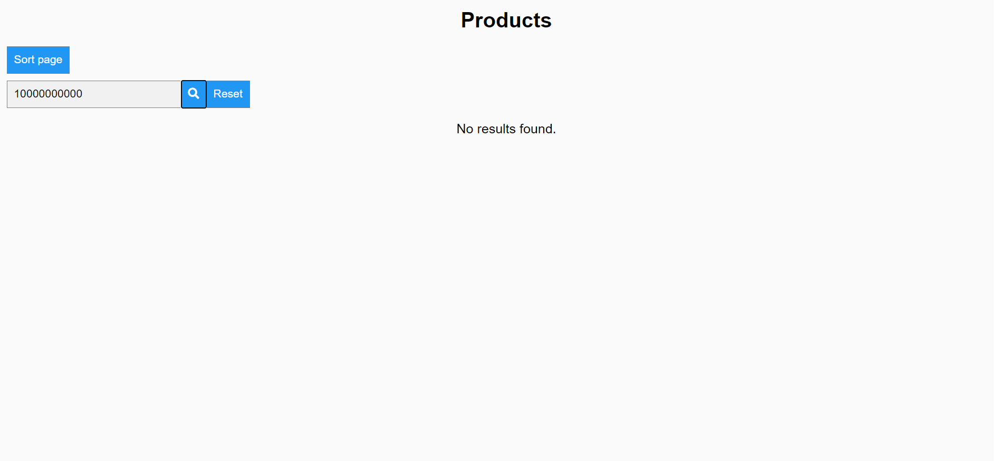

# server
## mysql & node.js

for mysql I run in the mysql command line 
```
mysql> 'source C:\Users\Manolis\Desktop\testProject\dbCreation.sql'
```
That way, the database and the table are created and the insertions are taking place.
Given than we needed more than 10000000 entries, my laptop needed more than 2 days :( and its still wasn't done, but I believe that the purpose is achieved as described below.

`index.js` initiates the connection to the database and defines the endpoints.
After cloning the repo, in order to setup the server we need to run `npm install` and to start it `node index.js`.

All the server does is select the data from the database given the page that is provided as a parameter from the client. It gets 10 rows at a time, and returns them to the client.


Here we see a json response that contains the data of the server (we are on `localhost:3000/products/?page=1`).

# client
## html
Simple header, buttons, divs, and the pagination section.


Here we see the initial page.
The data that we see, come from the server.

The divs are filled backwards on purpose so we will be able to sort it if we would like to.
If we press the `sort page` button, we display the results sorted.


This picture shows the sorting mechanism for the first page.


We can type a number in the input section and then press the button to find that product.

Here we see the outcome that we have if we press the search button with a number that is contained in the table of the database.



Here we can see the outcome that we have if we press the search button with a number that is not contained in the table of the dataset.


We can always press the `Reset` button to reset the page and provide again with all the divs.


Here we can see the page after we press the right angle arrow of the pagination several times. 
The displaying divs are now 41 - 50 (again we display it backwards so we can sort it) (we are
fetching data of an other page each time, increasing or decreasing the page variable of the url).